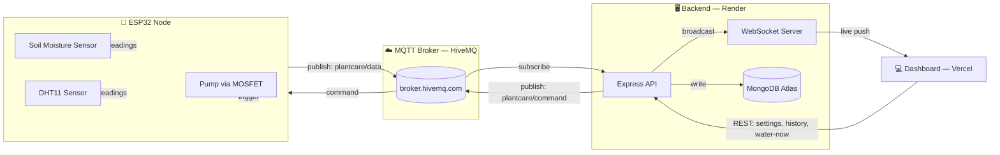

<div align="center">

# 🌱 PlantCare
### Automated Irrigation & IoT Telemetry System

An end-to-end IoT platform for real-time soil and microclimate monitoring, intelligent automated watering, and live web telemetry — powered by ESP32, Node.js, MQTT, and MongoDB.

[**Live Dashboard**](https://plantcare-azure.vercel.app) · [**Backend API**](https://plantcare-xagi.onrender.com)


</div>

---

## Overview

**PlantCare** bridges embedded hardware and web technologies to deliver precise, automated plant hydration management. An ESP32 continuously samples soil moisture, temperature, and humidity, evaluates watering thresholds locally, and streams telemetry over MQTT to a Node.js backend — which persists it to MongoDB and broadcasts live updates to a web dashboard over WebSockets.

---

## Key Features

- **Real-Time Telemetry** — Continuous sampling of soil moisture, ambient temperature, and relative humidity, published every 5 seconds.
- **Automated & Manual Irrigation** — Threshold-driven auto-watering logic running locally on the ESP32, plus instant manual trigger from the dashboard.
- **Live Dashboard** — Real-time stat cards and a soil-moisture history chart over WebSockets, with full historical logging in MongoDB Atlas.
- **Distributed Architecture** — Low-latency pub/sub MQTT messaging decouples the hardware node from the backend entirely.
- **Configurable Thresholds** — Auto-water trigger percentage and watering duration are adjustable live from the dashboard, no reflash needed.

---

## System Architecture



---

## How It Works

1. The ESP32 reads soil moisture + temperature/humidity every 5 seconds and publishes a JSON payload to `plantcare/data` over MQTT.
2. The backend subscribes to that topic, saves each reading to MongoDB, and broadcasts it to every connected dashboard client over WebSocket — no polling, true push updates.
3. If auto mode is on and soil moisture drops below the configured threshold, the ESP32 starts the pump locally — it doesn't wait on the network to make that call, so watering still works even if the backend is briefly unreachable.
4. The dashboard can also send a manual command (`water-now`, mode change, threshold update) — this goes backend → `plantcare/command` topic → ESP32, which applies it immediately.

---

## 🔌 Hardware & Wiring

| Component | ESP32 Pin | Notes |
|---|---|---|
| Soil Moisture Sensor (analog) | GPIO 34 | ADC1 — safe to read with Wi-Fi active |
| DHT11 (temp + humidity) | GPIO 4 | Digital, single-wire |
| MOSFET Trigger (`TRIG/PWM`) | GPIO 26 | Switches pump power |
| MOSFET Trigger (`GND`) | GND | Common ground |
| MOSFET `VIN+` | ESP32 5V | Powers the pump circuit |
| MOSFET `VIN-` | ESP32 GND | — |
| Pump (red wire) | MOSFET `OUT+` | — |
| Pump (black wire) | MOSFET `OUT-` | — |

**Pump:** Moto R1, 3–5V DC, max 1W.

---

## Tech Stack

| Layer | Stack |
|---|---|
| **Embedded** | ESP32 Dev Module, DHT11, Analog Soil Moisture Sensor, MOSFET Power Control Module |
| **Backend** | Node.js, Express.js, Mongoose, MQTT (`PubSubClient` / HiveMQ), WebSocket (`ws`) |
| **Frontend** | HTML5 / CSS3, vanilla JavaScript (ES6+), Chart.js |
| **Database** | MongoDB Atlas |
| **Hosting** | Render (backend) · Vercel (frontend) |

---

## 📁 Project Structure

```text
plantcare/
├── 📂 firmware/     # ESP32 C++ sketch — sensor sampling, MQTT pub/sub, local auto-watering logic
├── 📂 backend/      # Express API, MQTT subscriber, WebSocket broadcast, MongoDB models
└── 📂 frontend/     # Single-page live dashboard
```

---

## API Reference

| Method | Endpoint | Description |
|---|---|---|
| `GET` | `/api/settings` | Returns current mode, threshold, and watering duration |
| `POST` | `/api/settings` | Updates mode/threshold/duration, relays to ESP32 |
| `GET` | `/api/history?limit=40` | Returns most recent N sensor readings |
| `POST` | `/api/water-now` | Triggers an immediate manual watering cycle |
| `GET` | `/api/watering-events` | Returns watering event log |

Live data also pushes over WebSocket at the same host (`wss://`), message shape: `{ "type": "reading", "data": { soil, temp, humidity, pumpOn, mode, timestamp } }`.

---

## Setup

### Backend
```bash
cd backend
npm install
cp .env.example .env   # fill in MONGODB_URI and MQTT_BROKER
npm start
```

### Firmware
1. Open `firmware/plant_care/plant_care.ino` in Arduino IDE
2. Set your Wi-Fi `ssid` / `password`
3. Select **ESP32 Dev Module** as the board
4. Flash

### Frontend
Static — open `frontend/index.html` directly, or deploy as-is to any static host. Set `API_BASE` at the top of the `<script>` block to your backend URL.

---

## 📄 License

MIT © Rekia
